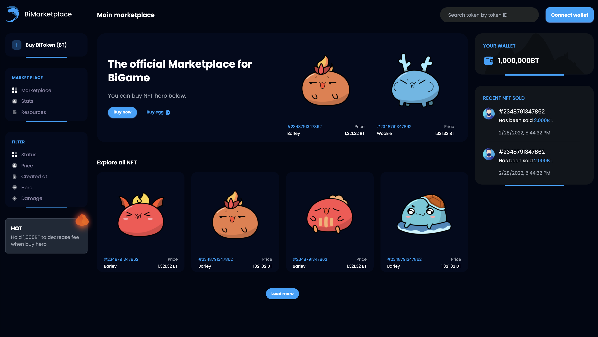
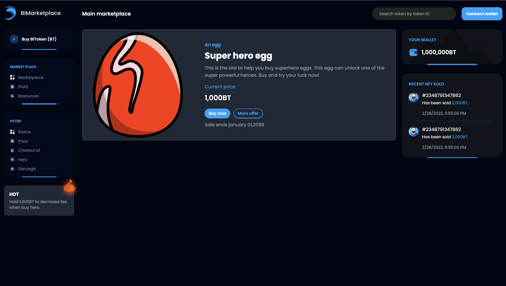

<p align="center">
  <a href="https://www.facebook.com/lequocbinh.04">
    
  </a>

  <h3 align="center">Frontend for BiMarketplace</h3>

  <p align="center">
    This branch is the Frontend code. If you have any questions, please contact me 😁
    <br>
    <a href="https://www.facebook.com/lequocbinh.04">Report bug</a>
    ·
    <a href="https://www.facebook.com/lequocbinh.04">Request feature</a>
  </p>
</p>

# Infomation

This branch is the Frontend code of BiMarketplace, this site is build with NextJS, Tailwind. 🚀

&nbsp;

# Getting Started

First, run the development server:

```bash
npm run dev
# or
yarn dev
```

Open [http://localhost:3000](http://localhost:3000) with your browser to see the result.

You can start editing the page by modifying `pages/index.js`. The page auto-updates as you edit the file.

[API routes](https://nextjs.org/docs/api-routes/introduction) can be accessed on [http://localhost:3000/api/hello](http://localhost:3000/api/hello). This endpoint can be edited in `pages/api/hello.js`.

The `pages/api` directory is mapped to `/api/*`. Files in this directory are treated as [API routes](https://nextjs.org/docs/api-routes/introduction) instead of React pages.

# Learn More

To learn more about Next.js, take a look at the following resources:

-   [Next.js Documentation](https://nextjs.org/docs) - learn about Next.js features and API.
-   [Learn Next.js](https://nextjs.org/learn) - an interactive Next.js tutorial.

You can check out [the Next.js GitHub repository](https://github.com/vercel/next.js/) - your feedback and contributions are welcome!

# Screenshot


<br/>

